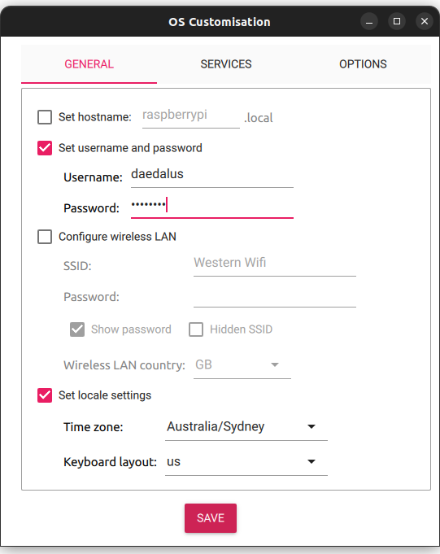
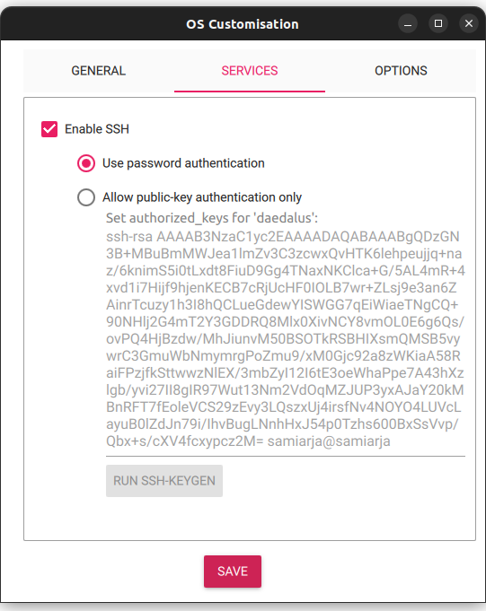
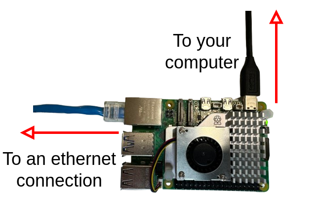

# Daedalus Core

This branch is maintained by: Sami Arja


## Table of Contents
- [Daedalus Core](#daedalus-core)
  - [Table of Contents](#table-of-contents)
  - [About](#about)
  - [Simple Install (Preferred)](#simple-install-preferred)
    - [Fast Manual Installation](#fast-manual-installation)
    - [Developer Install](#developer-install)
  - [Manual Installation (Ubuntu)](#manual-installation-ubuntu)
    - [Setting up the image](#setting-up-the-image)
    - [Connecting the Pi](#connecting-the-pi)
    - [SSH into the Pi (Terminal)](#ssh-into-the-pi-terminal)
    - [SSH into the Pi (VSC)](#ssh-into-the-pi-vsc)
  - [Manual Installation (Windows)](#manual-installation-windows)
    - [Setting up the image](#setting-up-the-image-1)
    - [Connecting to the Pi](#connecting-to-the-pi)
      - [Direct connection](#direct-connection)
      - [Ethernet connection](#ethernet-connection)
      - [Wi-Fi connection](#wi-fi-connection)
      - [Host computer](#host-computer)
  - [Configuring the Pi](#configuring-the-pi)
  - [How to use](#how-to-use)
    - [Accessing supervisord](#accessing-supervisord)
    - [Accessing mjpeg server](#accessing-mjpeg-server)
  - [How it works](#how-it-works)
  - [Modifying Daedalus Core](#modifying-daedalus-core)
    - [Sensor Scripts](#sensor-scripts)
    - [supervisor config](#supervisor-config)
  - [Appendix](#appendix)
    - [Installing Bonjour](#installing-bonjour)
    - [Using Windows as a host device](#using-windows-as-a-host-device)
      - [Automatic Method](#automatic-method)
      - [Manual Method](#manual-method)
  - [Make the final image (Ubuntu)](#make-the-final-image-ubuntu)
  - [Thermal/IR camera](#thermalir-camera)
    - [Configure Thermal/IR Camera](#configure-thermalir-camera)
    - [Install Aravis CLI](#install-aravis-cli)
    - [Assign static IP address](#assign-static-ip-address)
    - [Thermal/IR camera SDK from manufacturer](#thermalir-camera-sdk-from-manufacturer)


## About

Daedalus Core is a docker image and set of scripts that handle the collection of data from sensors on a raspberry pi. Daedalus core is designed to be flexible in implementation and simple to modify. It uses supervisord to daemonise python scripts for data collection and monitor their function.

## Simple Install (Preferred)

You can use a raspberry pi image preloaded with the required configuration if you don't want to go through the steps of installing all the prerequisites. For this you can contact Nic Ralph(n.ralph@westernsydney.edu.au) and he will provide you with the image. Using a tool like balenaEtcher or raspberry pi imager, you can load an SD card with the image and insert it into a raspberry pi and have it up and running.

**IMPORTANT NOTE:** The image is designed for raspberry pi 5 and may not be compatible with raspberry pi 4s.

### Fast Manual Installation

If you are already connected to raspberry pi running a fresh install of raspbian lite run the following command to complete the entire process:

```bash
sudo apt-get update && sudo apt install git -y && git clone https://github.com/Y2Kmeltdown/daedalus_core.git && cd daedalus_core && git checkout tripwire && sudo bash daedalusInstall.sh /home/$USER/data
```

### Developer Install

If you are developing daedalus core and need to test you can use the following command to install all dependencies onto the pi and set up the configuration without making any changes to the network interface or running scripts in supervisor.

```bash
sudo apt-get update && sudo apt install git -y && git clone https://github.com/Y2Kmeltdown/daedalus_core.git && cd daedalus_core && git checkout tripwire && sudo bash devScript.sh
```

## Manual Installation (Ubuntu)

### Setting up the image

Step 1: Install [raspberry pi imager](https://www.raspberrypi.com/software/) and select **Download for Ubuntu for x86** option. A .deb file will be downloaded.

Step 2: To install the .deb file run the following:

```sh
sudo dpkg -i imager_<whatever-version-that-is>_amd64.deb
```

Step 3: Search for **Imager** software.

Step 4: On the GUI select the following option:
    
    - CHOOSE DEVICE: Raspberry pi 5
    - CHOOSE OS: Raspberry Pi OS (other) -> Raspberry Pi OS Lite (64-bit) (No Desktop)
    - CHOOSE STORAGE: ***Select the option based on the SD card name***

Step 5: Edit the settings like in the figures below

<div align="center">


</div>

Username: daedalus

Password: daedalus

Step 6: Remove SD card and plug it into the raspberry pi.

### Connecting the Pi
You need the following cables:
    
    - A USB-C to USB cable
    - An ethernet cable

Connection looks like this:

<div align="center">

</div>


### SSH into the Pi (Terminal)

**Set Up Internet Connection Sharing on Ubuntu**
 
Open the Network Connections editor via terminal:

```sh
nm-connection-editor
```

**Create a New Ethernet Connection:**

- In the Network Connections window, click "Add".
- Select "Ethernet" and click "Create...".

**Configure the Ethernet Connection for Sharing:**

On the "IPv4 Settings" Tab:

- Set "Method" to "Shared to other computers"

**Save** the connection and close window.

**Find the Raspberry Pi's IP Address**

Open Terminal and run:

```sh
sudo apt install nmap
sudo nmap -sn 10.42.0.0/24
```

Example of the output:

```sh
Nmap scan report for 10.42.0.57
Host is up (0.00036s latency).
MAC Address: B8:27:EB:XX:XX:XX (Raspberry Pi Foundation)
```

Note the IP address of your Pi is (e.g., 10.42.0.57)

**SSH into the Raspberry Pi Using its IP Address**

In a new terminal, Run:

```sh
ssh daedalus@10.42.0.57
```

Example output:

```sh
The authenticity of host '10.42.0.57 (10.42.0.57)' can't be established.
ECDSA key fingerprint is SHA256:...
Are you sure you want to continue connecting (yes/no/[fingerprint])?
```

Type yes and press Enter.

### SSH into the Pi (VSC)

After following the steps from the previous section.

- Install the Remote - SSH extension in Visual Studio Code
- Press `Ctrl+Shift+P` to open the Command Palette
- Type `Remote-SSH: Add New SSH Host` and select it
- Enter your SSH connection: ssh daedalus@<ip_from_previous_section>
- Select the default SSH configuration (`~/.ssh/config`)
- Press `Ctrl+Shift+P` again and type `Remote-SSH: Connect to Host`, then select `daedalus@<ip_from_previous_section>`
- Type password: `daedalus`

The content of the config file will be like this:

```bash
Host daedalus
  HostName 10.42.0.123
  User daedalus
```

Don't forget to add the correct IP address.

All done!!

 Skip to `Configuring the Pi` section to proceed.


## Manual Installation (Windows)

### Setting up the image

To get started with daedalus core you will need a raspberry pi preferably a raspberry pi 5 and a suitably sized SD card for your application. Firstly you will need to install raspbian lite. The easiest way is to use the [raspberry pi imager](https://downloads.raspberrypi.org/imager/imager_latest.exe). Make sure you modify the settings to update the hostname to whatever is most memorable and set a simple username and password. Finally you should also go to services and enable ssh using password or public key authentication, this is the easiest way to interact with the raspberry pi once raspbian lite is installed. With all the settings done you can write the image to an SD card.

### Connecting to the Pi

Plug the SD card into the Raspberry Pi and boot the pi up. To connect to the raspberry pi you have four options:

#### Direct connection

Plug in a HDMI cable and a keyboard and mouse and you will be able to access the raspberry pi terminal directly from the hardware. You will still need an internet connection to install docker and the daedalus image.

#### Ethernet connection

Connect the Raspberry Pi via ethernet to the same network as your main computer then use SSH either through putty, powershell or git bash. If you are on windows I recommend installing bonjour as it will allow you to connect to the raspberry pi via it's hostname.

#### Wi-Fi connection

If you set up wireless LAN before writing the image to the SD card you can SSH into the pi if you are connected to the same network using the same steps as ethernet connection.

#### Host computer

Finally the most ideal method is to use your main computer as a host and connect an ethernet cable directly from the raspberry pi to an ethernet port on your main device. See [Using Windows as a host device](#using-windows-as-a-host-device) for setting up your computer as a host device.

## Configuring the Pi
Once you have a method of interacting with the raspberry pi you should set up a few things. 

First you should run the following commands to ensure the repositories are up to date and git is installed:

```bash
sudo apt-get update && sudo apt install git -y
```

With git installed you can clone the repository:

```bash
git clone https://github.com/Y2Kmeltdown/daedalus_core.git
```

Then navigate to the daedalus core folder and run daedalusInstall.sh with your preferred location for data. It is important to specify the full data path, for example `/home/<USERNAME>/data` as the script has to be run as root to allow configuration of certain files on the raspberry pi.

**IMPORTANT NOTE:** If you do not set a directory it will default to `/usr/local/daedalus/data`

```bash
cd daedalus_core
sudo bash daedalusInstall.sh </path/to/data>
```

The script sets all of the required raspberry pi configuration, moves the code and config into a permanent location, installs and starts supervisor, sets up the ethernet network as a host device then finally reboots to allow some changes to take affect. The data is stored in the specified location of the install script.

After rebooting, daedalus core should start acting as a host device making it easy to connect via ethernet while in remote locations and the status of sensors should be available at `daedalus.local`

## How to use

Daedalus Core is mostly designed to be a set and forget system once it is powered on and running it should start immediately collecting data but there are some methods of controlling the processes running on the raspberry pi. Daedalus core can be connected to via wifi. On boot, daedalus will load an access point named DAEDALUS which you can connect to to monitor it's function.

### Accessing supervisord

Once you connect to the daedalus access point you can view the supervisor webpage by navigating to `daedalus.local` or if you cannot resolve the hostname `192.168.4.1`

On the supervisord webpage you will see all sensor processes running or failing. Clicking on the processes will bring up logs which will display whatever information is being logged but most importantly if the process is failing it displays the error information.

### Accessing mjpeg server

The mjpeg server is used to display event data through a network stream to view externally from the pi. This process should only be used to view data and should not be left running while collecting long term event data. This server is primarily meant to aid in adjusting the focus of the event cameras before commencing data collection. The mjpeg servers can be accessed on `daedalus.local:8000` and `daedalus.local:8001` for each event camera connected. If you cannot resolve the hostname of the pi `192.168.4.1:8000` and `192.168.4.1:8001`. The mjpeg server is a view only webpage with a single stream of jpeg frames in the center of the page.

## How it works

Daedalus utilises supervisor to act as a daemonizer for all of your sensors. When the raspberry pi boots supervisor reads the config file `/etc/supervisor/conf.d/supervisord.conf` and launches each program in it as a seperate daemon and through either a webpage or supervisorctl you can view the processes, logs and status of each process. To add new sensors or modify how supervisor runs each sensor you can modify the configuration file or the python scritps directly which can be found in `$HOME/code`

## Modifying Daedalus Core

Daedalus Core can be broken into two main components, config and code. To add your own sensors to daedalus core you can do sso by following these guidelines.

### Sensor Scripts

To add a new sensor firstly you will need to make a script or executable that will run the sensor in a unending loop or for a designated time period. If you choose to add a python script you should also add any dependencies to the requirements.txt file. Supervisord is be able to run any form of executable or script as long as it has a command line method of execution. Put the sensor cript in the code directory and ensure the script has a method of choosing a directory to output data to that can be passed to the script on execution.

### supervisor config

Once you have a script ready you can add the daemon information in `config/supervisord.conf`.
The general structure of a program in daedalus core looks like this:

```bash
[program:<program_title>]
command=<command to call script file (MUST include a way to pass a path for the data file written like this SEDPLACEHOLDER/program_title)>
directory=/usr/local/daedalus/code
autorestart=true
startretries=10000
stdout_logfile=/var/log/supervisor/%(program_name)s.log
```

[camera config](https://datasheets.raspberrypi.com/camera/picamera2-manual.pdf)

## Appendix

### Installing Bonjour

Unfortunately Apple doesn't make it easy to install bonjour on windows as a standalone program. The easiest way to install it is to install [iTunes](https://secure-appldnld.apple.com/itunes12/001-80053-20210422-E8A3B28C-A3B2-11EB-BE07-CE1B67FC6302/iTunes64Setup.exe) which will include bonjour along side it. You can uninstall itunes and the other applications installed with it and it will leave bonjour installed.

### Using Windows as a host device

The best way to interact with the Raspberry Pi, is to use another computer as a network host and connect an ethernet cable directly to the raspberry pi. On windows you can do this by navigating to `control panel` then to `network and internet` then `network and sharing center` Finally to `Change Adapter Options` on the left side of control panel. From this page make note of the ethernet adapter you will be using. From this stage there are two options of how to set your computer as host.

#### Automatic Method

Navigate to the primary adapter which you use for internet connection then right click on the adapter and go to properties. In properties navigate to the sharing tab from the tabs at the top of the window. There will be a check box option that says "Allow other network users to connect through this computer's Internet connection". Check that tick box then underneath there is a drop down box that says "Home networking connection:". Select the ethernet adapter you are using for the raspberry pi in that dropdown box and now you should have a connection to the raspberry pi which you can test by typing `ipconfig /all` to find the ip address of the ethernet interface which is most likely `192.168.137.1`. Then you can type the command `arp -a` which will list all of the ip addresses connected to each interface which should include the raspberry pi. If you have bonjour installed you can also ping the raspberry pi by it's hostname `raspberrypi.local`

#### Manual Method

This method is mostly just an explanation of how windows works as a host device. From the interfaces section right click on the ethernet adapter which you will be using for the raspberry pi then go to properties. Inside the group box labelled "This connection uses the following items", locate the option "Internet Protocol Version 4 (TCP/IPv4)". Highlight the option then click properties. Change the toggle box selection from "Optain an IP address automatically" to "Use the following IP address:", then in the group box underneath enter the following values for each row:

| Field Name      | Value           |
|-----------------|-----------------|
| IP Address:     | `192.168.137.1` |
| Subnet Mask:    | `255.255.255.0` |
| Default gateway | `192.168.137.1` |

You will be forced to enter DNS addresses in the groupbox below as well. For this you can enter any DNS address you want to use. Normal DNS addresses can be something like `1.1.1.1` (Cloudflare) and `8.8.8.8` (Google)

The specific ip address `192.168.137.1` is important to windows because windows natively uses that ip address to run a dhcp server which will automatically provide ip addresses to connected devices. This is how the sharing option can actually share internet connections to connected devices.


## Make the final image (Ubuntu)
This step will allow you to make a producation ready image, no need to run daedalisinstallation.sh anymore. 

Step 1: Flash **Raspberry Pi OS Lite (64-bit) (No Desktop)**  on a small SD card (32GB recommanded)
Step 2: ssh daedalus@daedalus.local
Step 3: Run the following command
```bash
sudo apt-get update && sudo apt install git -y && git clone https://github.com/Y2Kmeltdown/daedalus_core.git && cd daedalus_core && git checkout daedalus4 && sudo bash daedalusInstall.sh /home/$USER/data
```

Step 4: Plug the SD card back to your machine

Step 5: Find the disk name
```sh
sudo fdisk -l
```

Step 6: Write the image file using dd command

```sh
sudo dd if=<path-to-sd-card> of=<path-to-output-image>/unshrunkdaedalus.img
```

Step 7: Shrink the image 

```sh
sudo pishrink.sh <path-to-output-image>/unshrunkdaedalus.img <path-to-output-image>/daedalus.img
```


## Thermal/IR camera

### Configure Thermal/IR Camera

Connect Pi to Wifi

`sudo raspi-config`

Add the following Wifi details:

Username: ICNS
Password: eip7ai-bughi9

Find the Pi new IP on the ICNS network (this need to be done before disconnecting the ethernet cable from the Pi):

`hostname -I`

This should give something like this (1st IP is for the ethernet and the 2nd IP is for the wifi):
192.168.1.105 10.42.0.87

### Install Aravis CLI
Aravis main repo: https://github.com/AravisProject/aravis
Aravis additional CLI: https://github.com/AravisProject/aravis-c-examples

```sh
sudo apt install libgstreamer1.0-dev libgstreamer-plugins-base1.0-dev
sudo apt-get install python3 ninja-build meson
sudo apt-get install libxml2-dev
sudo apt install cmake

cd aravis/
meson setup build
cd build
ninja
ninja install

cd aravis-c-examples/
meson setup build
cd build
ninja
ninja install
```

### Assign static IP address

Set a static IP for the IR camera
```sh
sudo ip addr add 169.254.100.1/16 dev eth0
sudo ip link set dev eth0 up
```

Test the IR camera output:

.`/06-multi-save -o ./out_frames -f 5`


### Thermal/IR camera SDK from manufacturer 

Link for software and Documentation:
https://drive.google.com/drive/folders/1FQiud23Fac2x_jqSlKIqPT27kXt2BTkO?usp=sharing

